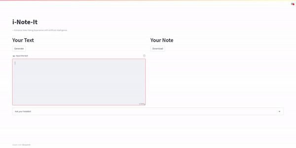

<p align="center">

</p>


[](https://youtu.be/ptGuxOxiN30 "Video Title")


## i-Note-It: Enhanced Note-Taking Experience with Artificial Intelligence


<!-- toc -->
- [Latest Features](#latest-features-star2)
- [How to use?](#how-to-use-book)
  - [Web Streamlit Demo](#web-streamlit-demo)
  - [Local Streamlit Demo](#local-streamlit-demo)
    - [Prerequisites](#prerequisites)
    - [Steps](#steps)
      - [Environment Configuration](#environment-configuration)
        - [Recommended (For Win64 Platform Only, Unfortunately)](#recommended-for-win64-platform-only-unfortunately)
        - [Alternative](#alternative)
      - [config.py](#configpy)
- [Behind the Scene](#behind-the-scene)
  - [Language Model](#language-model)
    - [Note Generation](#note-generation)
      - [Original Approach](#original-approach)
      - [Final Approach](#final-approach)
    - ["Hyperparameter" Tuning](#hyperparameter-tuning)
    - [Chatbot](#chatbot)
  - [UI Design](#ui-design-paintbrush)
    - [Tools](#tools)
    - [Layout](#layout)
    - [Logo](#logo)
- [Future Plans and Improvements](#future-plans-and-improvements)
- [Contributors](#contributors)
- [Bug Reports and Feature Requests](#bug-reports-and-feature-requests)
- [License](#license)


## Latest Features :star2:
<p align="center">
  
</p>

- Convert **textual input**, such as lecture transcripts and literature, into **streamlined** and **hierarchical** markdown formatted notes.
- The note generation performs best with English lecture transcripts that *start* and *end* with a **complete** word.
  - Other textual content, such as emoji, math formulas, and programming language(especially **Python**) are supported.
  - Language other than English is supported.
    - Languages Tested: English, Chinese

- Able to **download** the markdown file of the formatted note.
- A **chatbot** that can answer detailed inquiries related to the input.
  - This is useful when the user wants to have a deeper understanding of the material. 
    - For example, the user can input the class lecture transcript and generate the note. The user is then able to ask a question related to the class lecture that is inputted.

## How to use? :book:


### Web Streamlit Demo
[Web Demo](https://zslrmhb-i-note-it-streamlit--scriptsmain-yj2vod.streamlit.app/)

### Local Streamlit Demo

#### Prerequisites
| Tool | Version/Link|
| --- | --- |
| Python | 3.7 - 3.10 (The demo uses Python 3.9) |
| Streamlit | https://github.com/streamlit/streamlit |
| st-chat | https://github.com/AI-Yash/st-chat |
| AI21 Studio API Key | https://docs.ai21.com/ |


#### Steps
> NOTE BEFORE PROCEEDING: If you want to have a local version of the demo, you will need a custom-train Jurassic-1 Grande Model. For more information on obtaining your model, feel free to reach out in the **Discussions** or **Issues** sections for more detail.

##### Environment Configuration

###### Recommended (For Win64 Platform Only, Unfortunately)
1. Clone this GitHub Repository
2. Follow the instruction in the [requirements.txt](requirements.txt) to initialize the conda environment

###### Alternative
1. Install the packages listed in the prerequisite (suggest using Anaconda to manage the environment) 

##### config.py
- As you may or may not notice, the program requires a config.py and we did not include it for not sharing the API token. 
- You are going to set it up in your local environment, here is how:
  1. Once you have done all the steps above(Configured the environment), go to your cloned repository.
  2. Navigate into the **scripts** folder of the cloned repository.
  3. Create a **config.py** file with content in the following format
  ```PYTHON
  API_TOKEN = ""       
  NOTETAKER_MODEL_URL = ""
  NOTEBOT_MODEL_URL = ""
  ```
    - API_TOKEN: Your AI21 Studio API KEY
    - NOTETAKER_MODEL_URL = The URL of your customized note-generation model
    - NOTEBOT_MODEL_URL = The URL of your chatbot model
      - ex
        ```PYTHON
        NOTEBOT_MODEL_URL = "https://api.ai21.com/studio/v1/j1-jumbo/complete"
        ```


## Behind the Scene :sun_behind_small_cloud:

### Language Model
#### Note Generation


##### Original Approach
- Prompt Engineering (Jurassic-1 Grande Model)
  - Zero-Shot Prompt
    - Simply asking the model to generate notes without providing examples  
    - Worse Performance, give illogical and inconsistent outputs
  - Few-Shots Prompt
    - Asking the model to generate notes by providing it with a few examples
    - Better than the zero-shot prompt, but have a higher latency
##### Final Approach
- AI21 Lab Customized Jurassic-1 Grande Model 
  - Trained a customized note generation model on the top of Jurassic-1 Grande
  - Training data comes from video transcripts from various platforms such as Canvas, Youtube， TED Talks, and Coursera covering various domains/subjects. In addition, English literature such as the passages from William Shakespeare are included in the training data
    - Feel Free to reach out, such as in the **Discussions** or **Issues** for a more detailed explanation of the training process
  - Overall better performance and lower latency than the original approach

#### "Hyperparameter" Tuning
- Note-taking does not require too much randomness, but low temperature makes the notes tedious. Thus, we kept the temperature at about 0.3 to let the model be creative. We also tuned the max-token of the model to optimize for the best note generation result

#### Chatbot
- AI21 Lab Jurassic-1 Jumbo Model
  - Use 3 instructions as prompt, see [notebot.py](scripts/notebot.py)
  - Feed the input transcript as the *Context* for the Question *Inquiry*

### UI Design :paintbrush:
#### Tools 
| Tool | Usage|
| --- | --- |
| [Streamlit](https://github.com/streamlit/streamlit) | note-generation interface |
| [st-chat](https://github.com/AI-Yash/st-chat) | chatbot for Question-Answering |
| [Figma](https://www.figma.com/) | logo design |

#### Layout 
- For the two main features of our application, we let the main feature, the text input, and note area, cover most upper area of the  page. We then put the Chatbot below  as an auxiliary feature.
#### Logo
- The three parts of the logo match "i", "Note", and "It", respectively. This AI note-generation idea reminds us of how people took notes in ancient China with a writing brush, which required so much effort and preparation. Now, not only have "i" changed from human to A"I", but the writing brush we used for "N"ote has changed to keyboard. We are excited about how AI will bring more convenience to other aspects of human lives, just like the way we take notes can be revolutionized by AI, and just like the way this logo design was inspired by ideas from Stable Diffusion. 

## Future Plans and Improvements
<table>
  <tbody>
    <tr>
      <th align="center"> Features/Plans </th>
      <th align="center"> Specifics </th>
    </tr>
    <tr>
      <td align="center"> Note Generation </td>
      <td align="left">   
        <ul> 
          <li> domain-specific and user-specific </li>
          <li> larger input size </li>
          <li> variety of Input format </li>
            <ul>  
              <li> Audio </li>
              <li> Video </li>
              <li> Web URL </li>
              <li> ... </li>
            </ul>
          <li> Richer Markdown format, such as highlighting important information </li>
        </ul>   
    </td>
    </tr>
    <tr>
      <td align="center"> User Interface </td> 
      <td align="left">   
        <ul> 
          <li> More professional and well-designed User Interface </li>
        </ul>               
      </td>
    </tr>
    <tr>
      <td align="center"> Supporting Platforms </td>
      <td align="left">   
        <ul> 
          <li> Multiple Platforms </li>
        </ul>               
      </td>
    </tr>
    <tr>
      <td align="center"> ... </td>
      <td align="center">   ...  </td>
    </tr>
  </tbody>
</table>


## Contributors
- See [Contribute](CONTRIBUTING.md)


## Bug Reports and Feature Requests
- See [Bug Report](.github/ISSUE_TEMPLATE/bug_report.md)
- See [Feature Request](.github/ISSUE_TEMPLATE/feature_request.md)

## License
- See [License](LICENSE)
