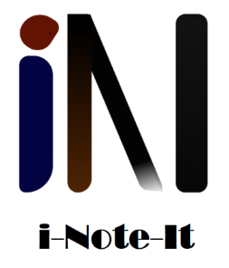

<p align="center">

</p>

--------------------------------------------------------------------------------------------------------------------------------------------------

[](https://youtu.be/ptGuxOxiN30 "Video Title")


## i-Note-It: Enhanced Note-Taking Experience with Artificial Intelligence

<!-- toc -->
- [Features](#latest-features)
- [How to use?](#how-to-use)
  - [Web Version](#web-streamlit-demo)
  - [Local Version](#local-streamlit-demo)
    - [Prerequisites](#prerequisites)
    - [Steps](#steps)
      - [Environment Configuration](#environment-configuration)
- [Behind the Scene](#behind-the-scene)
  - [Language Model](#language-model)
    - [Note Generation](#note-generation)
      - [Original Approach](#original-approach)
      - [Final Approach](#final-approach)
    - ["Hyperparameter Tuning"](#hyperparameter-tuning)
    - [Chatbot](#chatbot)
  - [UI and Logo Design](#ui-and-logo-design)
    - [UI](#ui)
    - [Logo](#logo)
  - [Future Plans and Improvements](#future-plans-and-improvements)


## Latest Features 
- Convert textual input, such as lecture transcripts and literature, into **streamlined** and **hierarchical** markdown formatted note.
- The note generation performs best with English lecture transcripts that *start* and *end* with **complete** word.
  - Other textual content, such as emoji, math formulas and programming language(especially **Python**) are supported.
  - Language other than English is supported.
    - Languages Tested: English, Chinese

- Able to **download** the markdown file of the formatted note.
- A **chatbot** that can answer detailed inquiry related to the input.
  - This is really useful when the user want to have a deeper understanding of the material. 
    - For example, the user can input the class lecture transcript and generate the note. The user is then able to ask question related to the class lecture that is inputted.

## How to use?


### Web Streamlit Demo
[Web Demo](https://zslrmhb-i-note-it-streamlit--scriptsmain-yj2vod.streamlit.app/)

### Local Streamlit Demo

#### Prerequisites
- Python 3.7 - 3.10 
  - The demo uses Python 3.9
- Streamlit: https://github.com/streamlit/streamlit
- st-chat: https://github.com/AI-Yash/st-chat
- API Key from AI21 Studio: https://docs.ai21.com/

#### Steps
> NOTE BEFORE PROCEEDING: If you want to have a local version of the demo, you will need a custom-train Jurassic-1 Grande Model. For more information in obtaining your own model, feel Free to reach out in the **Discussions** or **Issues** sections for a more detail.

##### Environment Configuration

###### Recommended (For Win64 Platform Only, Unfortunately)
1. Clone this Github Repository
2. Follow the instruction in the [requirements.txt](requirements.txt) to initialize the conda environment

###### Alternative
1. Install the packages listed in the prerequisite (suggest using Anaconda to manage the environment) 

##### config.py
- As you may or may not notice, the program requires a config.py and we did not included it for the purpose of not sharing the API token. 
- You going to set it up in your local environment, here is how:
  1. Once you have done all the steps above(Configured te environment), go to your cloned repository.
  2. Navigate into the **scripts** folder of the cloned repository.
  3. create a **config.py** file with content in the following format
  ```PYTHON
  API_TOKEN = ""       
  NOTETAKER_MODEL_URL = ""
  NOTEBOT_MODEL_URL = ""
  ```
    - API_TOKEN: Your AI21 Studio API KEY
    - NOTETAKER_MODEL_URL = The URL of your customized note generation model
    - NOTEBOT_MODEL_URL = The URL of your chatbot model
      - ex
        ```PYTHON
        NOTEBOT_MODEL_URL = "https://api.ai21.com/studio/v1/j1-jumbo/complete"
        ```


## Behind the Scene

### Language Model
#### Note Generation


##### Original Approach
- Prompt Engineering (Jurassic-1 Grande Model)
  - Zero-Shot Prompt
    - Simply asking the model to generate note without providing examples 
    - Worse Performance, give illogical and inconsistent outputs
  - Few-Shots Prompt
    - Asking the model to generate note by providing it with few examples
    - better than the zero-shot prompt, but have a higher latency
##### Final Approach
- AI21 Lab Customized Jurassic-1 Grande Model 
  - Trained a customized note generation model on the top of Jurassic-1 Grande
  - Training data comes from video transcripts from various platform such as Canvas, Youtube， TED Talks and Coursera covering various domains/subjects. In addition, English literature such as passage from William Shakespeare are included in the training data
    - Feel Free to reach out, such as in the **Discussions** or **Issues** for a more detail explanation of the training process
  - Overall better performance and lower latency from the original approach

#### "Hyperparameter" Tuning
- Tuned the temperature and max-token of the model to optimize for best note generation result

#### Chatbot
- AI21 Lab Jurassic-1 Jumbo Model
  - Use 3 instructions as prompt, see [notebot.py](scripts/notebot.py)
  - Feed the input transcript as the *Context* for the Question *Inquiry*

### UI and Logo Design

#### UI
- Use Streamlit for the demo User Interface
  - Have the main functionality(note generation) presented as 2 columns (input and output) 
  - Put the chatbot in an expander for optional use, so it will not take up the majority of the space for the note display

#### Logo
- Took the first letter of each word of   "i-Note-lt"

### Future Plans and Improvements
- Domain-Specific Note Generation
- Accept larger input size for note generation
  - Slice the input into chunks to make note generation more efficient
- Accept input other than text for note generation
  - Audio
  - Video 
  - Web URL
  - ...
- User-Specific Note-Taking Model
- Multiple Platform
- And much more!!!


  
How did we make it?
- Preparation: We were using Jurassic-1 provided by Ai21, so we explore the model first.
  - Prompt engineering: Note taking is summarization by nature, so we tried to suggest the model summarizing materials provided. 
    - Zero shot and few shots learning: At the beginning, we gave the model direct prompt to generate notes from given text. However, some parts of the materials are not covered in the notes, and the notes were not logical. We gave the model several examples and tried the few shots learning afterward, and we encountered some other problems, including slow api call in request and response.  
    - Customized model: To solve the problems we have with zero and few shots learning, we decided to train our customized model. we used ChatGPT to generate dataset with over 90 training data: texts and corresponding target notes in assigned formats. 
  - Hyperparameter tuning: Note taking does not require too much randomness. Thus, we reduced the temperature, so the model will produce more rigorous notes. (TO be modified) 
- UI design: For the two main features of our application, we let the major feature, the text  input and note area, to cover most upper area of the main page; we then put Chatbox below it as an auxiliary feature.  
- Implementation: 
  - Tools: 
    - Streamlit for implementing note generation text interface. 
    - Streamlit chatbot for Question-answering bot. 
    - Custom-trained Jurassic-1 grande api for notes generation.
    - Jurassic-1 Jumbo api for Chatbot
  - User Interface:
    - Layout: Two columns for input text and note generated, one expander below for Chatbot. 
  - Prepocessing:
  - Postprocessing:
  - 
    
